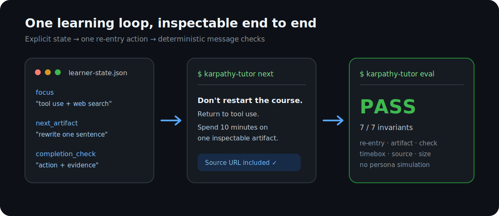
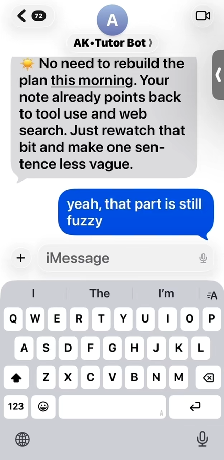
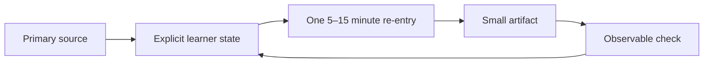

# Karpathy Course Tutor

[](https://github.com/cheryljia27-commits/karpathy-course-tutor/actions/workflows/ci.yml)

An unofficial, source-grounded learning tool for returning to Andrej Karpathy's
public courses without rebuilding the study plan from scratch.

The **Agent Skill** is the adaptive coaching layer. A zero-dependency
**Python CLI** provides the inspectable state, message preview, progress
recording, and deterministic message-invariant checks. No model API or key is
required to verify the public repository.



The original interface experiment is kept separately:

<a href="assets/demo.mp4">
  
</a>

*An 8-second, anonymized interaction prototype. Click the image for the H.264
video. The iMessage transport is not included in the public repository.*

## Origin

This project began as a private AI Tutor Bot I built for myself while working
through Andrej Karpathy's online courses. The material was available; the
recurring problem was returning after an interruption without reconstructing
what I had understood, where the explanation had broken down, and what the
smallest useful next step should be.

The public version extracts that reusable learning mechanism from the original
interface experiment: explicit learner state, one source-grounded action, one
small artifact, and one observable completion check. Private notes and message
transport remain outside the repository.

## Verify it in three minutes

Requires Python 3.10 or newer.

```bash
git clone https://github.com/cheryljia27-commits/karpathy-course-tutor.git
cd karpathy-course-tutor
python3 -m venv .venv
source .venv/bin/activate
python -m pip install -e ".[dev]"

pytest
karpathy-tutor next --state examples/learner-state.json
karpathy-tutor eval --state examples/learner-state.json
```

Expected: the tests pass, the generated message cites a primary source, and
the evaluation label is `pass`.

## What is implemented

| Layer | What it does | Where to inspect |
| --- | --- | --- |
| Agent Skill | Reduces messy notes or a stuck point to one source-grounded learning action | [`skill/karpathy-course-tutor/SKILL.md`](skill/karpathy-course-tutor/SKILL.md) |
| Deterministic core | Validates learner state, previews a re-entry message, records progress, and checks message invariants | [`src/karpathy_course_tutor/`](src/karpathy_course_tutor/) |
| Source pack | Maps 14 creator-owned public sources to teaching moves and minimum artifacts | [`source-packs/karpathy-ai-systems/course-map.md`](source-packs/karpathy-ai-systems/course-map.md) |
| Seed eval set | Exercises a valid re-entry, generic encouragement, and persona simulation | [`examples/eval-set.json`](examples/eval-set.json) |

## The product idea

When self-study is interrupted, the lecture and notes still exist. What is
usually missing is a cheap answer to:

> Where exactly should I restart?

This project treats initiation as a state-selection problem. It keeps the
current source, unresolved loop, next artifact, observable check, and timebox
explicit, then asks an agent to choose the smallest useful return.



## Representative Agent Skill run

The bundled Agent Skill was run against the public sample state for an
interruption during the tool-use section of *Deep Dive into LLMs like ChatGPT*.
It kept the current source, rejected the tempting full-lecture restart, and
returned one bounded intervention:

```text
Re-entry: Explain what the model checked, not only what tool use does.
Artifact: Spend 10 minutes rewriting one sentence in notes/tool-use.md.
Check: Pass if the sentence names both the external action and the returned evidence.
Source: Deep Dive into LLMs like ChatGPT
        https://www.youtube.com/watch?v=7xTGNNLPyMI
```

See the complete input, agent decision, output, and observable result in
[`examples/agent-skill-run.md`](examples/agent-skill-run.md).

## Deterministic CLI example

Given the synthetic state in
[`examples/learner-state.json`](examples/learner-state.json), the deterministic
preview produces:

```text
Don't restart the whole course. Return to “tool use and web search”:
Explain what the model checked, not only what tool use does. Spend 10 minutes
on one artifact: Rewrite one sentence in notes/tool-use.md.
Check: The sentence names both the external action and the returned evidence.
Source: Deep Dive into LLMs like ChatGPT → https://www.youtube.com/watch?v=7xTGNNLPyMI
```

The `eval` command is deliberately narrow: it checks message invariants such as
the current loop, artifact, verification condition, timebox, primary-source
URL, response size, and persona boundary. It is not a claim of end-to-end model
quality.

## Use it as an Agent Skill

Install the bundled skill without silently merging it into an older copy:

```bash
destination="$HOME/.codex/skills/karpathy-course-tutor"
mkdir -p "$(dirname "$destination")"
if [ -e "$destination" ]; then
  echo "Already exists: $destination"
else
  cp -R skill/karpathy-course-tutor "$destination"
fi
```

Then invoke it with a note or learner-state file:

```text
Use $karpathy-course-tutor to turn this stuck point into one
source-grounded 10-minute learning artifact.
```

The skill supports three modes:

- re-enter an interrupted course or lecture;
- understand one mechanism through a tiny inspectable artifact;
- review an artifact using an observable pass/fail check.

## Source and identity boundaries

- Cite a primary creator-owned source for specific claims.
- Keep teaching-pattern synthesis labeled as interpretation.
- Assign an artifact and a check; do not pretend the message created the work.
- Never claim what Karpathy “would say,” imitate his voice, or invent quotes.
- Do not redistribute course videos, full transcripts, or private material.

The source pack contains official URLs, original teaching-move summaries, and
minimum artifacts. The teacher and original source remain the authority.

## Repository map

```text
src/karpathy_course_tutor/  deterministic state, message, progress, and eval CLI
skill/                      adaptive Agent Skill
source-packs/               curated primary-source learning map
examples/                   learner state, Agent Skill run, and seed eval cases
docs/                       product thesis, architecture, and evaluation rubric
tests/                      state, CLI, behavior, and source-pack checks
.github/workflows/          supported-version and installed-wheel verification
assets/                     anonymized interaction prototype
```

For the deeper reasoning, see
[`docs/product-thesis.md`](docs/product-thesis.md),
[`docs/architecture.md`](docs/architecture.md), and
[`docs/evaluation.md`](docs/evaluation.md).

## Public/private boundary

The original prototype used private Obsidian source notes and an iMessage
surface. This repository does not distribute those source note files or any
contact identifiers. The included demo is an anonymized interface recording.
Transport remains separate from the tutoring core, so the same message can be
delivered by a scheduler, local notification, chat integration, or agent
runtime.

## Status

`v0.1.0` is a small reference implementation. The open product question is
whether the system selects the right re-entry point and reliably causes one
useful learning artifact, not whether it can sustain a long chat.

## License and attribution

Original code and documentation are MIT licensed. Public source links and
third-party titles belong to their respective owners. See [NOTICE.md](NOTICE.md).
