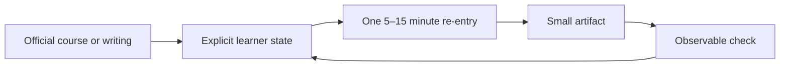

# Karpathy Course Tutor

An unofficial, source-grounded AI tutor for learning from Andrej Karpathy’s
public courses without repeatedly rebuilding your study plan.

It remembers the **learning state**, chooses one **small re-entry point**, and
ends with a concrete **artifact and check**. It does not impersonate Karpathy,
invent quotes, or replace the original material.

[Watch the 8-second prototype](assets/demo.mp4)

## The problem

When self-study is interrupted, the lecture and notes are still there. What is
usually missing is a cheap answer to:

> Where exactly should I restart?

Most tutors wait for the learner to initiate a new conversation. This project
treats initiation as a state-selection problem.



## What it produces

Given the sample state:

```json
{
  "current_source_id": "deep-dive-llms",
  "focus": "tool use and web search",
  "open_loop": "Explain what the model checked, not only what tool use does.",
  "next_artifact": "Rewrite one sentence in notes/tool-use.md",
  "completion_check": "The sentence names the action and returned evidence.",
  "timebox_minutes": 10
}
```

the deterministic preview produces:

```text
Don't restart the whole course. Return to “tool use and web search”:
Explain what the model checked, not only what tool use does. Spend 10 minutes
on one artifact: Rewrite one sentence in notes/tool-use.md.
Check: The sentence names the action and returned evidence.
Source: Deep Dive into LLMs like ChatGPT → https://www.youtube.com/watch?v=7xTGNNLPyMI
```

An AI agent using the bundled skill can make that intervention more adaptive
while keeping the same source, state, artifact, and evaluation boundaries.

## Quick start

Requires Python 3.10 or newer.

```bash
git clone git@github.com:cheryljia27-commits/karpathy-course-tutor.git
cd karpathy-course-tutor
python3 -m venv .venv
source .venv/bin/activate
python -m pip install -e .

karpathy-tutor next --state examples/learner-state.json
karpathy-tutor eval --state examples/learner-state.json
karpathy-tutor sources --track llm-systems
```

Create a private learner-state file:

```bash
karpathy-tutor init --output learner-state.json
```

`learner-state.json`, `.env`, and `private/` are gitignored by default.

## Use it as an Agent Skill

The repository includes a self-contained Agent Skill:

```text
skill/karpathy-course-tutor/
```

To make it available to Codex locally:

```bash
cp -R skill/karpathy-course-tutor ~/.codex/skills/
```

Then invoke it with a note or learner-state file:

```text
Use $karpathy-course-tutor to turn this stuck point into one
source-grounded 10-minute learning artifact.
```

The skill supports three modes:

- re-enter an interrupted course or lecture;
- explain a concept through a tiny inspectable artifact;
- review an artifact using an observable pass/fail check.

## Karpathy-specific source pack

This is not merely a generic tutor schema with a famous name attached. The
bundled source pack organizes primary public material into three practical
tracks:

1. **LLM systems** — tokens, next-token prediction, context, Transformers,
   pretraining, post-training, tools, memory, and limitations.
2. **Agent and tutor loops** — state, tools, workflows, source-of-truth files,
   human-in-the-loop design, and small complete systems.
3. **Evaluation and verification** — baselines, golden cases, failure
   taxonomies, groundedness, and empirical debugging.

Every entry contains an official URL, an original teaching-move summary, and a
minimum artifact. See
[`source-packs/karpathy-ai-systems/course-map.md`](source-packs/karpathy-ai-systems/course-map.md).

The pack intentionally contains **no full transcripts**. The teacher and the
original source remain the authority.

## Design rules

- **Source before synthesis.** Cite the primary material used.
- **Smallest complete thing first.** Reduce broad study goals to an inspectable
  object.
- **Artifact over conversation.** End with code, a note, a diagram, an eval
  row, or another durable object.
- **Verification before complexity.** Define what success or failure looks
  like.
- **Quiet memory.** Use learner history to select the next step, not to perform
  intimacy.
- **No persona simulation.** Never claim what Karpathy “would say.”

## Repository map

```text
src/karpathy_course_tutor/  zero-dependency state, selection, and eval CLI
source-packs/               curated primary-source learning map
skill/                      installable Agent Skill
examples/                   synthetic learner state and eval examples
docs/                       thesis, architecture, and evaluation rubric
tests/                      behavioral and source-pack checks
assets/                     original prototype demo
```

## What the public version leaves out

The original prototype used private Obsidian notes and an iMessage re-entry
surface. This repository includes neither personal notes nor contact details.
Transports are deliberately separate from the tutoring core: the message can
be delivered by a scheduler, a local notification, a chat app, or an agent
runtime.

## Status

`v0.1` is a small, inspectable reference implementation. The interesting
question is not whether the tutor can chat. It is whether the tutor can select
the right re-entry point and reliably cause one useful learning artifact.

## License and attribution

Original code and documentation are MIT licensed. Public source links and
third-party titles belong to their respective owners. See [NOTICE.md](NOTICE.md).
