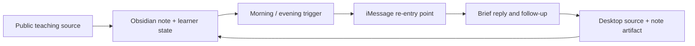

# AI Tutor Bot

[](https://github.com/cheryljia27-commits/ai-tutor-bot/actions/workflows/ci.yml)

A sanitized public reference implementation of the AI Tutor Bot first shared
on X: a proactive, source-grounded iMessage loop for preserving continuity in
interrupted self-study.

The private prototype reads the current learner state and Obsidian course note
twice a day, sends one source-backed re-entry point over iMessage, and follows
up briefly when the learner replies. The pedagogy still comes from the teacher,
and the understanding still happens in the learner's source material and
notes. The phone only owns the moment of re-entry.

<a href="assets/demo.mp4">
  
</a>

*An 8.5-second, anonymized recording of the original `AK · Tutor Bot` loop:
notification → iMessage anchor → learner reply → brief follow-up → Obsidian
course note. Click the image for the H.264 video.*

## Origin

I built the original AI Tutor Bot for myself while working through Andrej
Karpathy's online courses. The material was not the problem. After a study
session was interrupted, the source and notes were still there, but the plan
often did not restart itself. I had to reconstruct what I understood, where
the explanation had broken down, and what the smallest useful next step should
be.

The prototype tested a narrower idea:

> AI does not need to perform the understanding for the learner. It can
> preserve one concrete way back into the learning process.

What changed was not what I could access once I sat down. It was what happened
before I sat down. The system did not make the course easier; it made the first
step back into the course smaller. I think of it as a small **continuation
layer for learning**.

The private system used an Obsidian state file, the current raw course note,
scheduled morning and evening triggers, and an iMessage read/send bridge. This
repository publishes the reusable and inspectable parts without exposing
private notes, contact identifiers, or transport credentials.

## The loop shared on X



The key behavior is not “send a reminder.” The tutor must:

- read the current learning state instead of inventing a generic topic;
- choose one source-backed re-entry point;
- keep the phone interaction low-bandwidth;
- stop after a brief follow-up rather than maximizing conversation;
- return the learner to the primary source and a durable note or artifact.

The sanitized morning interaction from the demo is:

```text
☀️ No need to rebuild the plan this morning.

Your note already points back to tool use and web search.

Just rewatch that bit and make one sentence less vague.
```

After the learner replies that the section is still fuzzy:

```text
Good. Make the sentence say what the model checked, not just what tool use does.
```

See the complete evening anchor, morning re-entry, learner replies, and desktop
artifact in
[`examples/sanitized-tutor-loop.md`](examples/sanitized-tutor-loop.md).

## What this public repository implements

The private iMessage scheduler is not published. The repository packages the
parts that make the behavior inspectable and reusable:

| Layer | What it does | Where to inspect |
| --- | --- | --- |
| Sanitized tutor loop | Reconstructs the interaction and desktop artifact shown in the demo | [`examples/sanitized-tutor-loop.md`](examples/sanitized-tutor-loop.md) |
| Agent Skill | Interprets notes and selects one bounded, source-grounded re-entry action | [`skill/ai-tutor-bot/SKILL.md`](skill/ai-tutor-bot/SKILL.md) |
| Deterministic core | Validates learner state, previews messages, records progress, and checks message invariants | [`src/ai_tutor_bot/`](src/ai_tutor_bot/) |
| Source pack | Maps 14 creator-owned public sources to teaching moves and minimum artifacts | [`source-packs/karpathy-ai-systems/course-map.md`](source-packs/karpathy-ai-systems/course-map.md) |
| Seed eval set | Exercises a valid re-entry, generic encouragement, and persona simulation | [`examples/eval-set.json`](examples/eval-set.json) |

No model API or key is required to verify the public reference core.

## Verify it in three minutes

Requires Python 3.10 or newer.

```bash
git clone https://github.com/cheryljia27-commits/ai-tutor-bot.git
cd ai-tutor-bot
python3 -m venv .venv
source .venv/bin/activate
python -m pip install -e ".[dev]"

pytest
ai-tutor-bot next --state examples/learner-state.json
ai-tutor-bot eval --state examples/learner-state.json
```

Expected: the tests pass, the generated message cites a primary source, and
the evaluation label is `pass`.

## Deterministic CLI example

Given the synthetic state in
[`examples/learner-state.json`](examples/learner-state.json), the deterministic
preview produces:

```text
Don't restart the whole course. Return to “tool use and web search”:
Explain what the model checked, not only what tool use does. Spend 10 minutes
on one artifact: Rewrite one sentence in notes/tool-use.md.
Check: The sentence names both the external action and the returned evidence.
Source: Deep Dive into LLMs like ChatGPT → https://www.youtube.com/watch?v=7xTGNNLPyMI
```

The CLI is the public verification layer, not a substitute for the private
proactive runtime. Its `eval` command checks the current loop, artifact,
completion condition, timebox, primary-source URL, response size, and identity
boundary.

## Use it as an Agent Skill

Install the bundled skill without silently merging it into an older copy:

```bash
destination="$HOME/.codex/skills/ai-tutor-bot"
mkdir -p "$(dirname "$destination")"
if [ -e "$destination" ]; then
  echo "Already exists: $destination"
else
  cp -R skill/ai-tutor-bot "$destination"
fi
```

Then invoke it with a note or learner-state file:

```text
Use $ai-tutor-bot to turn this interrupted course note into one
source-grounded re-entry point and a small learning artifact.
```

The skill supports three modes:

- re-enter an interrupted course or lecture;
- understand one mechanism through a tiny inspectable artifact;
- review an artifact using an observable pass/fail check.

## Product and identity boundaries

- The message is a doorway, not the classroom or IDE.
- The tutor points to a learning discontinuity; it does not act like a boss.
- Learner history is used to select work, not to perform intimacy.
- Specific claims cite a primary creator-owned source.
- Teaching-pattern synthesis is labeled as interpretation.
- The tutor never claims what Karpathy “would say,” imitates his voice, or
  invents quotes.
- Course videos, full transcripts, private notes, and contact metadata are not
  redistributed.

`AK · Tutor Bot` was the transparent contact label used in the original demo:
`AK` marked the Karpathy-inspired source context, `Tutor` described the
course-level role, and `Bot` kept the artificial boundary visible. The public
project name is **AI Tutor Bot**.

## Repository map

```text
src/ai_tutor_bot/           deterministic state, message, progress, and eval CLI
skill/ai-tutor-bot/         adaptive Agent Skill
source-packs/               curated primary-source learning map
examples/                   sanitized loop, learner state, and seed eval cases
docs/                       product thesis, architecture, and evaluation rubric
tests/                      state, CLI, behavior, and source-pack checks
.github/workflows/          supported-version and installed-wheel verification
assets/                     anonymized original interaction prototype
```

For the deeper reasoning, see
[`docs/product-thesis.md`](docs/product-thesis.md),
[`docs/architecture.md`](docs/architecture.md), and
[`docs/evaluation.md`](docs/evaluation.md).

## Status

`v0.1.0` is a sanitized reference implementation of the AI Tutor Bot. It
documents the original proactive loop and ships its reusable state, Skill,
source-grounding, progress, and evaluation layers. It does not ship the private
Obsidian vault, production scheduler, iMessage bridge, or personal message
history.

The open product question is whether the system selects the right re-entry
point and reliably causes one useful learning artifact, not whether it can
sustain a long chat.

## License and attribution

Original code and documentation are MIT licensed. Public source links and
third-party titles belong to their respective owners. See [NOTICE.md](NOTICE.md).
